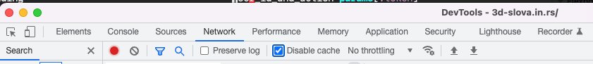

# 3D Foam letters

This is a repo for http://3d-slova.in.rs/
TODO: add online svg creator https://github.com/SVG-Edit/svgedit 

TODO: italy costycnc boboaca costel  https://www.youtube.com/channel/UCgZyZAxu2SkYqpyaNQ018Wg

plyshaper.eu https://www.youtube.com/@polyshaper

# Developing

Start jekyll server

```
jekyll s
```

and open the browser on http://127.0.0.1:4000/

We used this tutorial to insert Tailwind CSS into Jekyll:
Starting a blank Jekyll site with Tailwind CSS in 2022 : https://mzrn.sh/2022/04/09/starting-a-blank-jekyll-site-with-tailwind-css-in-2022/


# Deploy

We use Github Pages to serve our site. Since Github Pages does not support using
plugins we will manually build the site and deploy to remote branch `gh-pages`.
To deploy you can run

```
rake
```

Since we do not use finger print for assets, changes in stylesheets probably
will not be visible right away.
You can check latest styles with
```
curl 3d-slova.in.rs/assets/css/main.css
```
but better is to disable cache in dev tools


To see actual site you can download gh-pages branch
```
git checkout -t origin/gh-pages

# inspect the site using docker http server on http://localhost:8080
docker run -v $(pwd):/web -p 8080:8080 halverneus/static-file-server:latest

git checkout main
# remove branch locally
git branch -D gh-pages

```
